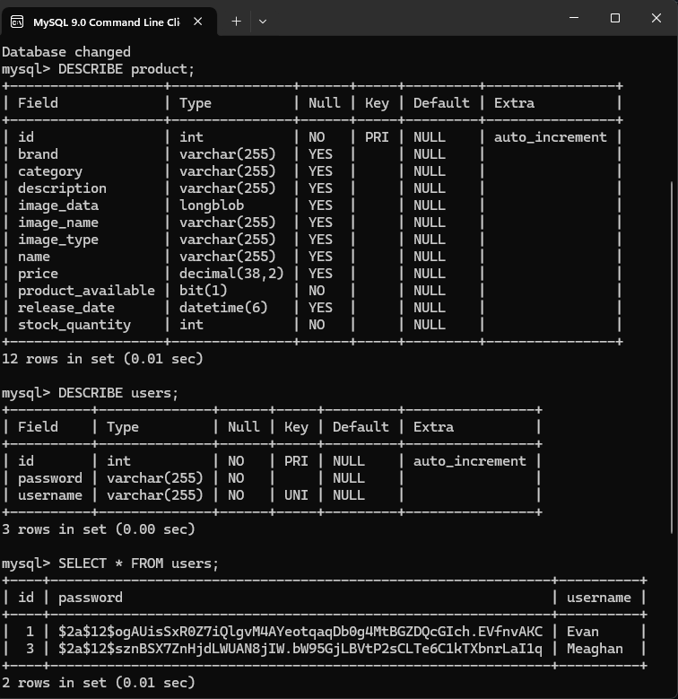

E-commerce Site!
================

This website serves as a place to browse, buy, and sell merchandise.

It utilizes a search bar that can help you find unqiue listings, and a filter that can help you hone in on what you might be looking for.

The listings are highly customizable, allowing you to show the name, brand, price, description, a picture, and more.

<h2>HOW IT WAS MADE</h2>

This website was built using the React library for the front-end, and Spring Boot w/ MySQL for the back-end. 

 Evan built the backend entirely utilizing Spring Boot's Web, JPA (MySQL), Security, and Lombokdependencies, all built with Maven.

The websites security utilized a basic authentication process (username/password) and a bearer token (JWT) process

The front-end was not built by Evan, however portions of it were changed by him, including all bug fixes. The front-end uses React (JS) and Bootstrap.

This completed project mostly serves as a portfolio piece, although Evan and his partner may one day make this project into something they can use.

